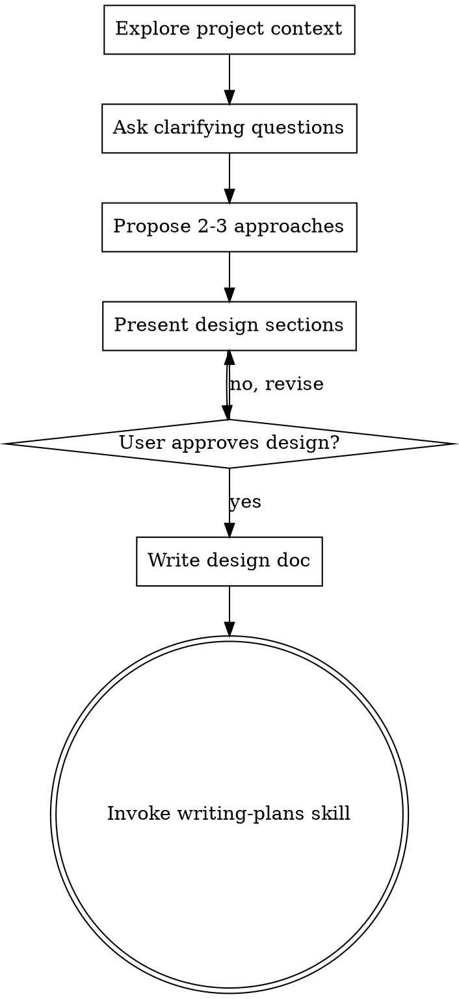

# Brainstorming Ideas Into Designs

## Overview

Help turn ideas into fully formed designs and specs through natural collaborative dialogue.

Start by understanding the current project context, then ask questions one at a time to refine the idea. Once you understand what you're building, present the design and get user approval.

<HARD-GATE>
Do NOT invoke any implementation skill, write any code, scaffold any project, or take any implementation action until you have presented a design and the user has approved it. This applies to EVERY project regardless of perceived simplicity.
</HARD-GATE>

## Anti-Pattern: "This Is Too Simple To Need A Design"

Every project goes through this process. A todo list, a single-function utility, a config change — all of them. "Simple" projects are where unexamined assumptions cause the most wasted work. The design can be short (a few sentences for truly simple projects), but you MUST present it and get approval.

## Checklist

You MUST create a task for each of these items and complete them in order:

1. **Explore project context** — check files, docs, recent commits
2. **Ask clarifying questions** — one at a time, understand purpose/constraints/success criteria
3. **Propose 2-3 approaches** — with trade-offs and your recommendation
4. **Present design** — in sections scaled to their complexity, get user approval after each section
5. **Write design doc** — save to `docs/plans/YYYY-MM-DD-<topic>-design.md` and commit
6. **Transition to implementation** — invoke writing-plans skill to create implementation plan

## Process Flow



**The terminal state is invoking writing-plans.** Do NOT invoke frontend-design, mcp-builder, or any other implementation skill. The ONLY skill you invoke after brainstorming is writing-plans.

## The Process

**Understanding the idea:**
- Check out the current project state first (files, docs, recent commits)
- Ask questions one at a time to refine the idea
- Prefer multiple choice questions when possible, but open-ended is fine too
- Only one question per message - if a topic needs more exploration, break it into multiple questions
- Focus on understanding: purpose, constraints, success criteria

**Exploring approaches:**
- Propose 2-3 different approaches with trade-offs
- Present options conversationally with your recommendation and reasoning
- Lead with your recommended option and explain why

**Presenting the design:**
- Once you believe you understand what you're building, present the design
- Scale each section to its complexity: a few sentences if straightforward, up to 200-300 words if nuanced
- Ask after each section whether it looks right so far
- Cover: architecture, components, data flow, error handling, testing
- Be ready to go back and clarify if something doesn't make sense

## After the Design

**Documentation:**
- Write the validated design to `docs/plans/YYYY-MM-DD-<topic>-design.md`
- Use elements-of-style:writing-clearly-and-concisely skill if available
- Commit the design document to git

**Implementation:**
- Invoke the writing-plans skill to create a detailed implementation plan
- Do NOT invoke any other skill. writing-plans is the next step.

## Key Principles

- **One question at a time** - Don't overwhelm with multiple questions
- **Multiple choice preferred** - Easier to answer than open-ended when possible
- **YAGNI ruthlessly** - Remove unnecessary features from all designs
- **Explore alternatives** - Always propose 2-3 approaches before settling
- **Incremental validation** - Present design, get approval before moving on
- **Be flexible** - Go back and clarify when something doesn't make sense

## Visual Companion (Claude Code Only)

When brainstorming involves visual elements - UI mockups, layouts, design comparisons - you can use a browser-based visual companion instead of ASCII art. **This only works in Claude Code.**

### When to Offer

If the brainstorm involves visual decisions (UI layouts, design choices, mockups), ask the user:

> "This involves some visual decisions. Would you like me to show mockups in a browser window? (Requires opening a local URL)"

Only proceed with visual companion if they agree. Otherwise, describe options in text.

### Starting the Visual Companion

```bash
# Start server (creates unique session directory)
${CLAUDE_PLUGIN_ROOT}/lib/brainstorm-server/start-server.sh

# Output looks like:
# {"type":"server-started","port":52341,"url":"http://localhost:52341",
#  "screen_dir":"/tmp/brainstorm-12345-1234567890",
#  "screen_file":"/tmp/brainstorm-12345-1234567890/screen.html"}
```

**Save the `screen_dir` and `screen_file` paths from the response** - you'll need them throughout the session.

Tell the user to open the URL in their browser.

### Showing Content

Write complete HTML to the session's `screen_file` path. The browser auto-refreshes.

Use the frame template structure from `${CLAUDE_PLUGIN_ROOT}/lib/brainstorm-server/frame-template.html`:
- Keep the header and feedback-footer intact
- Replace `#claude-content` with your content
- Use the CSS helper classes (`.options`, `.cards`, `.mockup`, `.split`, `.pros-cons`)

See `${CLAUDE_PLUGIN_ROOT}/lib/brainstorm-server/CLAUDE-INSTRUCTIONS.md` for detailed examples.

### Waiting for User Feedback

Start the watcher as a background bash command, then use TaskOutput with block=true to wait:

```bash
# 1. Start watcher in background
${CLAUDE_PLUGIN_ROOT}/lib/brainstorm-server/wait-for-event.sh $SCREEN_DIR/.server.log

# 2. Call TaskOutput(task_id, block=true, timeout=600000) to wait
# 3. If timeout, call TaskOutput again (watcher is still running)
# 4. After 3 timeouts (30 min), say "Let me know when you want to continue" and stop looping
```

When the user clicks Send in the browser, the watcher exits and TaskOutput returns with feedback:
```json
{"choice": "a", "feedback": "I like this but make the header smaller"}
```

### The Loop

1. Start watcher (background bash) - must be FIRST to avoid race condition
2. Write screen HTML to `screen_file`
3. Call TaskOutput(task_id, block=true, timeout=600000) to wait
4. TaskOutput returns with feedback
5. Respond with new screen
6. Repeat until done

### Cleaning Up

When the visual brainstorming session is complete, pass the screen_dir to stop:

```bash
${CLAUDE_PLUGIN_ROOT}/lib/brainstorm-server/stop-server.sh $SCREEN_DIR
```

### Tips

- **Keep mockups simple** - Focus on layout and structure, not pixel-perfect design
- **Limit choices** - 2-4 options is ideal
- **Regenerate fully** - Write complete HTML each turn; the screen is stateless
- **Terminal is primary** - The browser shows things; conversation happens in terminal
